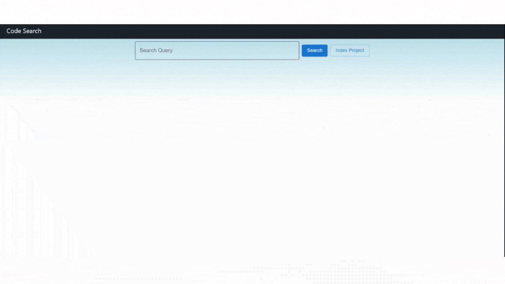

# CodeSearch

<p align="center">

</p>

# Introduction
CodeSearch is natural language query tool for codebases. It uses the OpenAI API for getting the embedding vectors and indexes them using the FAISS library. When you query the system, it matches the query vector to the top 5 results and display in a web-based UI.

When you enter a project path, the tool searches for all the code files inside the project (including subdirectories), generates its Abstract Syntax Tree (using libCST library), indexes each of the function, along with its filepath, class name, function name, line number and embedding vector. It then stores all of this in a local PostgreSQL database.

- **Fast Setup**: We have Docker support to quickly setup a working environment
- **Interactive UI**: We have created a interactive web-based UI for searching
- **Language Support**: Currently we support Python and Javascript. Adding new languages shortly
- **GPU and CPU Support**: The tool has support for GPU as well as CPU

# Setup

- Get your OpenAI API key from [link](https://beta.openai.com/)
- Rename the `/backend/codesearch/.env.sample` to `/backend/codesearch/.env` and add your API key in it

### CPU

- Rename `/backend/Dockerfile_cpu` to `/backend/Dockerfile` and `./docker-compose_cpu.yml` to `./docker-compose.yml`
- Run the Docker container:

```bash
$ docker compose up > logs.txt
```

### GPU (NVIDIA)

- Install the NVIDIA container toolkit from their official website [link](https://nvidia.github.io/nvidia-docker/)
- Use the default `/backend/Dockerfile` and `./docker-compose.yml` files
- Run the Docker container:

```bash
$ docker compose up > logs.txt
```

# Usage

- Once you run the `docker compose up` command. The application should be up and running on `http://localhost:4000/`
- Open `http://localhost:4000/` on the browser
- Click on `Index Project` button and enter the absolute path to your project to be indexed
- It should take about 30 secs to index the project. You can see the progress on `logs.txt` which is created
- Once completed, enter your query in the search box and it will return the top 5 results for your search

